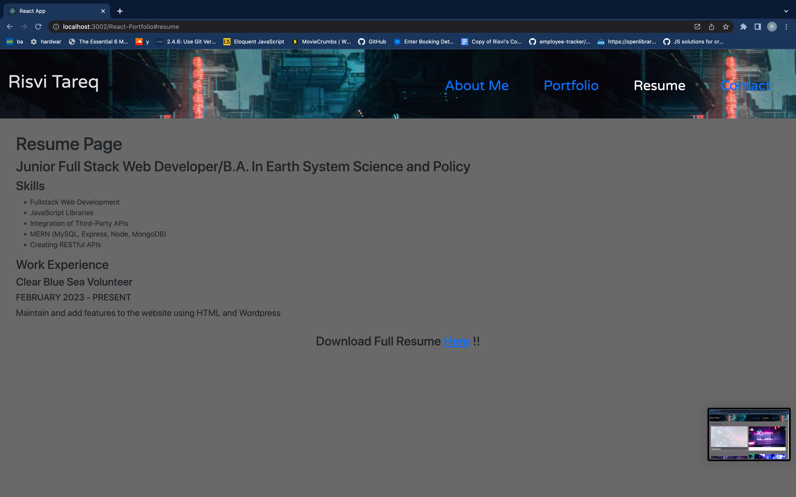
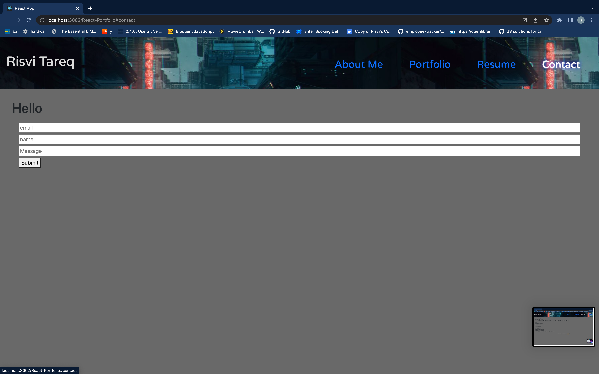

# React-Portfolio

## Description
I was assigned a project in which I had to create a Professional Portfolio using React. It contained various links to my contact information and serves as a landing page for my class projects. The styling is need of work, but it is fully functional for the most part. 

## Table of Contents
<nav>
    <ol>
        <li><a href="#How to Use this Project">How to Use this Project</a></li>
        <li><a href="#Contributors">Contributors</a></li>
    </ol>
</nav>

## How to Use this Project
<a href="https://ivsir.github.io/React-Portfolio/">This is the link to my WebPage</a>

## Questions
<li>https://github.com/ivsir </li>
<li>Email: ivsirqerat@gmail.com</li>

## Contributors
Risvi Tareq